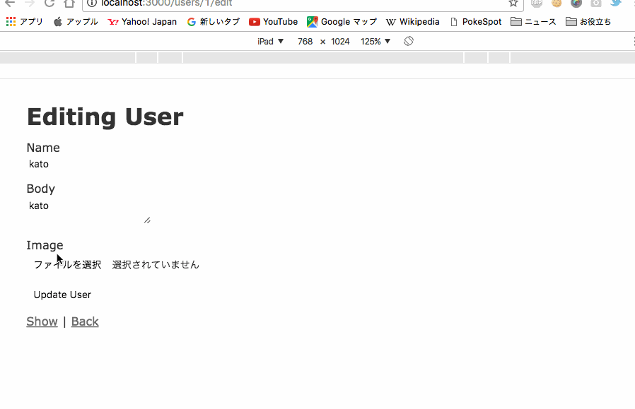

caryweave + rails の練習

See
- http://qiita.com/unchiman-tojour-haraita/items/cc447237e23bf10d159e

- http://stackoverflow.com/questions/11485967/   Best way to show image previews before upload in rails & carrierwave

- http://marketing-web.hatenablog.com/entry/rails_upload_carrierwave_fog 20160328
rails4で画像をS3にアップロードする [carrierwave + imagemagick + fog + S3 + Dropzone]

- http://morizyun.github.io/blog/carrierwave-image-uploader-rails/  Carrierwave + Rails 4.2.5 画像アップローダー

- https://miningoo.com/782 CarrierWaveを利用した画像アップロード機能をRailsに実装しサムネイルとかに使う方法まとめ

スクリーンショット

